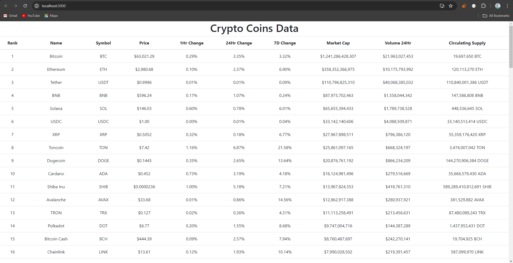

# Coin-market

1. Created a web coin that scrapes data from coinmarketcap.com.
2. Created a Django Project with: 
  - HTTP POST request to update the data in the database.
  - HTTP GET request to retrieve the latest data from the database.
3. Created a React Project that requests the data from the backend using the GET request and displays the data in a tabular format on a web page with refresh rate of 3 secs.

#### STEPS:

## 1. Clone repository using git clone command
 - git clone "<Repo Link>"

## 2. Open 3 Terminals inside this repository

## 3. 1st Terminal
  Step 1: Change directory to coin-market-backend
  - cd coin-market-backend

  Step 2: create a virtualenv
  - virtualenv venv

  Step 3: Activate Virtualenv
  - venv/Scripts/activate

  Step 3: install required packages
  - pip intall -r requirements.txt

  Step 4: Start Django project
  - python manage.py runserver

## 4. 2nd Terminal:
  Step 1: Activate the same environment here as well
  - coin-market-backend/venv/Scripts/activate

  Step 2: install rendering engines.
  playwright install

  Step 3: Run coin
  - python coin.py

## 5. 3rd Terminal:
  Step 1: Change directory to coin-market-frontend
  - cd coin-market-frontend

  Step 2: install required packages
  - npm i

  Step 3: run react project
  - npm start

### Web Page Preview:
